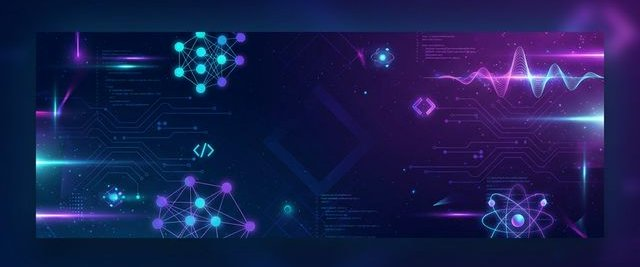

  

<h1 align="center">
  
</h1>

  
  
  
  

  
  

---

## 🧑‍💻 About Me

🎓 **Dokuz Eylül University** — Physics Department  
📍 İzmir / Ankara, Turkey  
💼 I develop **websites** and **automation software** for small businesses and medium-sized industrial companies  
🎮 Passionate about game development with Unreal Engine  
🤖 Researching and developing in **Artificial Intelligence** and **Machine Learning**  
📱 Building iOS & Android mobile applications  

---

## 🛠️ Technologies & Tools

  **Programming Languages**

  
  
  
  
  
  
  

  **Frameworks & Platforms**

  
  
  
  
  

  **Tools & Other**

  
  
  
  
  

---

## 🚀 Featured Projects

<table>
  <tr>
    <td width="50%">
      <h3 align="center">⚡ Reactorware</h3>
      

        
      

      
Software project built with <strong>C#</strong> ⭐ 2

    </td>
    <td width="50%">
      <h3 align="center">📻 SomaFM</h3>
      

        
      

      
Radio & media platform for the Soma & Aegean region — <strong>TypeScript</strong> ⭐ 1

    </td>
  </tr>
  <tr>
    <td width="50%">
      <h3 align="center">🌐 Personal Website</h3>
      

        
      

      
Personal portfolio & showcase website — <strong>HTML</strong> ⭐ 1

    </td>
    <td width="50%">
      <h3 align="center">💄 Eny Beauty</h3>
      

        
      

      
Beauty brand website — <strong>HTML / CSS</strong>

    </td>
  </tr>
</table>

---

## 📊 GitHub Statistics

  
  

  

  

---

## 🏆 GitHub Achievements

  

---

## 🐍 Contribution Graph

  

---

  

  <i>💡 "Physics is for understanding the universe, software is for changing it." </i>

